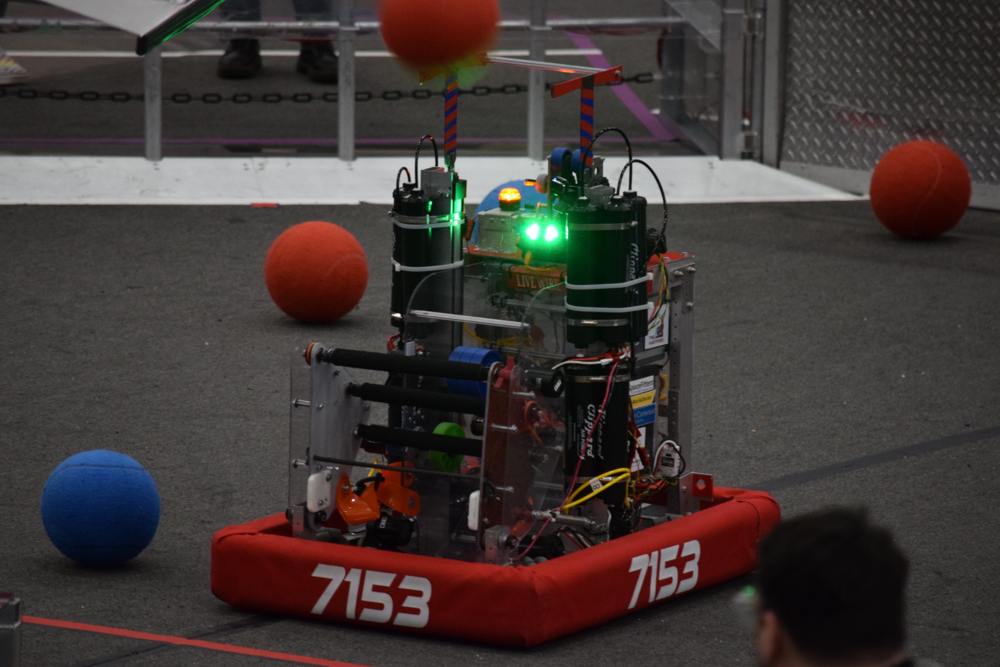
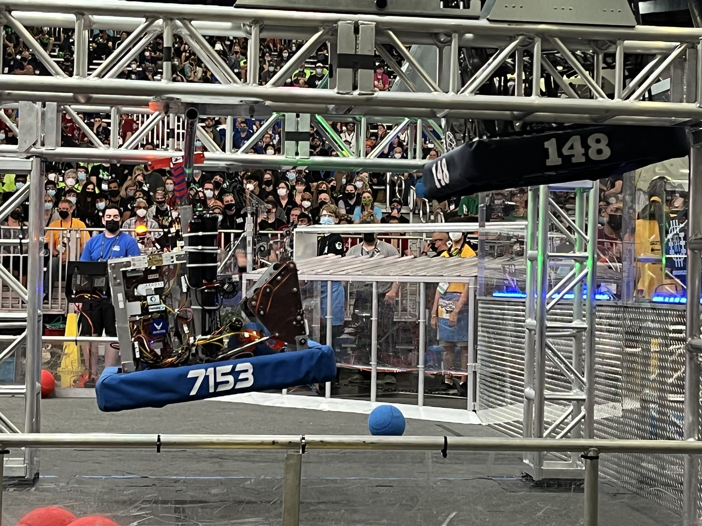

# Rapid React

*"Live Wire"* 
FRC 7153, Aetos Dios  
Rapid React, 2022 Season

> This is a rewrite. The code used in official competition can be found in the `master` 
branch, and is primarily undocumented. As of right now, there are no autonomous programs 
for this rewrite.

## Overview
- Mecanum drive
- Pneumatic over-bumper intake
- Flywheel shooter and indexer, 2-ball capacity
- Pneumatic climbing mechanism (mid-rung)
- Limelight for targeting (auto-center, speed adjustment)

## Controls
* **Xbox Controller 0:**
    * **Left Joystick:** Drive base strafe
    * **Left Joystick Press:** Sprint (high-speed)
    * **Right Joystick:** Drive base rotation
    * **Left Bumper:** Limelight target auto-center
    * **Y Button:**: Climbers extend (deprecated)

## Competitions
- Western NE
- Worcester Polytechnic Institute
- New England District Champs (Titanium division)
- World Champs (Hopper division)
- BattleCry @ WPI 22 (offseason)
- Bash at the Beach (offseason)

View Hardware IDs

### CAN IDs
0. RoboRio
1. Main Power Distribution Hub (REV PDH)
2. ~~Climber~~ Pneumatics Hub (REV Pneumatics Hub)
3. Front Left Drive Motor (NEO/CAN Spark Max)
4. Front Right Drive Motor (NEO/CAN Spark Max)
5. Rear Left Drive Motor (NEO/CAN Spark Max)
6. Rear Right Drive Motor (NEO/CAN Spark Max)
7. Shooter Motor 1 (NEO/CAN Spark Max)
8. Shooter Motor 2 (NEO/CAN Spark Max)
9. Intake Wheel Motor (AndyMark NeveRest/TalonSRX)
10. Indexer Wheel Motor (Falcon500/TalonFX)
11. *(unassigned)*
12. ~~Intake Pneumatics Hub (CTRE Pneumatics Control Module)~~

### ~~Intake Pneumatics Hub (CAN 12)~~
4. ~~Right Extend Channel~~
5. ~~Right Retract Channel~~
6. ~~Left Retract Channel~~
7. ~~Left Extend Channel~~

> Originally, the CTRE PCM (CAN 12) was used for the intake solenoids, which operated
at 12V, and the REV PH (CAN 2) was used for the climbing solenoids, which operated 
at 24V. After the climbing pistons and solenoids were removed, the intake solenoids 
were moved to the REV PH, and the CTRE PCM was removed.

